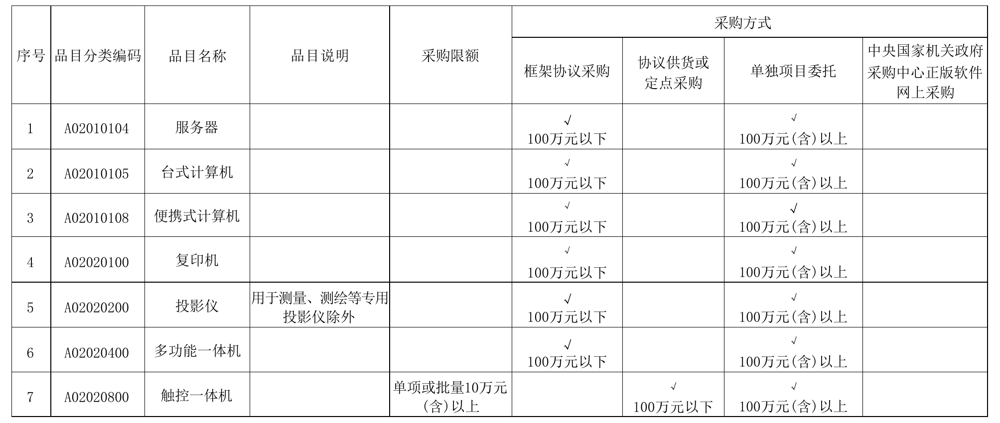
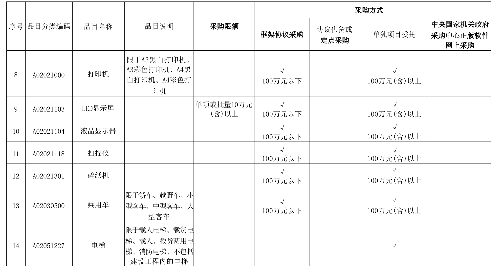
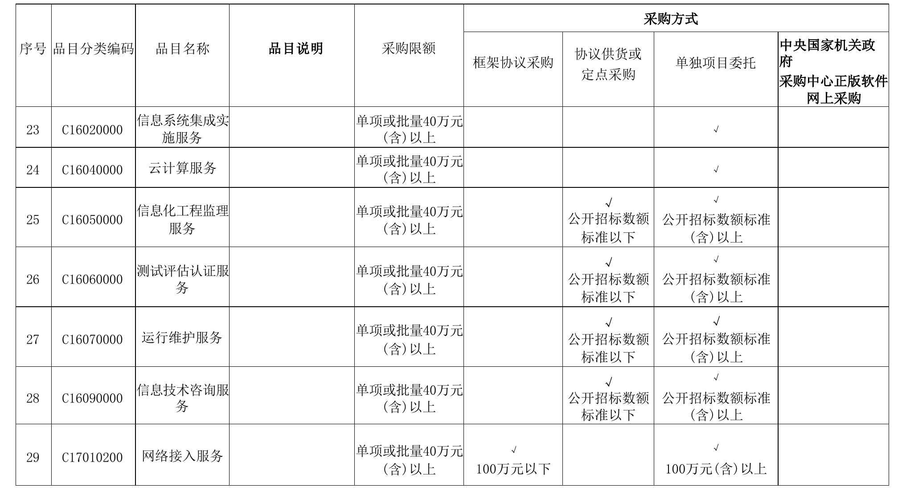
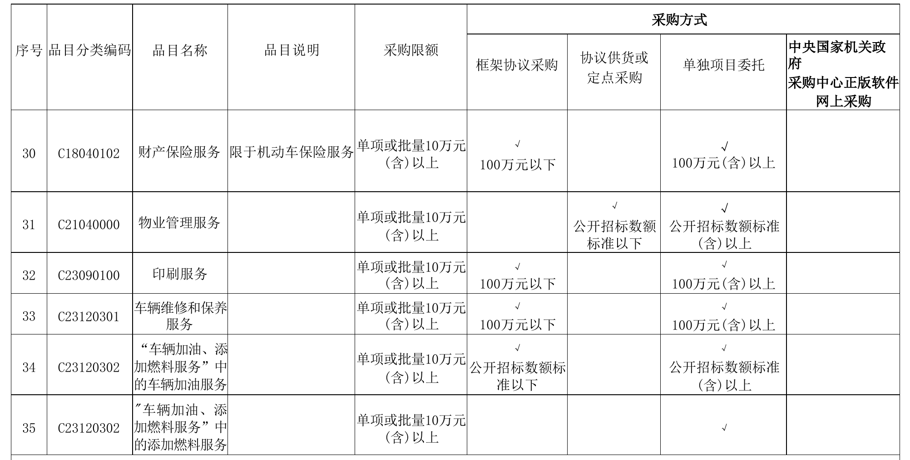

市直各采购人： 为贯彻落实《关于印发湖北省政府集中采购目录及标准 （2025年版）的通知》（鄂财采发（2024）7号）有关要求，进一 步做好市直各采购人政府集中采购工作，现将执行2025年度政 府集中采购目录及标准有关事项通知如下： 一、框架协议采购通过“武汉市政府采购电子商城”（以下 简称“电子商城”）框架协议采购专区实施；协议供货或定点采 购通过“电子商城”协议定点专区实施。各品目相关说明和采购 方式详见附件。 二、“电子商城”范围内的货物和服务无法满足需要的，采 购人可以以单独项目按照法律法规规定的采购方式执行。 附件：2025年度政府集中采购品目实施方案说明

---

武汉市政府采购中心 2024年12月18日

---

附件

---

这是一个采购方式表格，包括序号、品目分类编码、品目名称、品目说明、采购限额以及四种采购方式（框架协议采购、协议供货或定点采购、单独项目委托、中央国家机关政府采购中心正版软件网上采购）。

1. 序号：1
   - 品目分类编码：A02010104
   - 品目名称：服务器
   - 采购限额：无
   - 采购方式：
     - 框架协议采购：100万元以下
     - 协议供货或定点采购：无
     - 单独项目委托：100万元（含）以上
     - 中央国家机关政府采购中心正版软件网上采购：无

2. 序号：2
   - 品目分类编码：A02010105
   - 品目名称：台式计算机
   - 采购限额：无
   - 采购方式：
     - 框架协议采购：100万元以下
     - 协议供货或定点采购：无
     - 单独项目委托：100万元（含）以上
     - 中央国家机关政府采购中心正版软件网上采购：无

3. 序号：3
   - 品目分类编码：A02010108
   - 品目名称：便携式计算机
   - 采购限额：无
   - 采购方式：
     - 框架协议采购：100万元以下
     - 协议供货或定点采购：无
     - 单独项目委托：100万元（含）以上
     - 中央国家机关政府采购中心正版软件网上采购：无

4. 序号：4
   - 品目分类编码：A02020100
   - 品目名称：复印机
   - 采购限额：无
   - 采购方式：
     - 框架协议采购：100万元以下
     - 协议供货或定点采购：无
     - 单独项目委托：100万元（含）以上
     - 中央国家机关政府采购中心正版软件网上采购：无

5. 序号：5
   - 品目分类编码：A02020200
   - 品目名称：投影仪
   - 品目说明：用于测量、测绘等专用投影仪除外
   - 采购限额：无
   - 采购方式：
     - 框架协议采购：100万元以下
     - 协议供货或定点采购：无
     - 单独项目委托：100万元（含）以上
     - 中央国家机关政府采购中心正版软件网上采购：无

6. 序号：6
   - 品目分类编码：A02020400
   - 品目名称：多功能一体机
   - 采购限额：无
   - 采购方式：
     - 框架协议采购：100万元以下
     - 协议供货或定点采购：无
     - 单独项目委托：100万元（含）以上
     - 中央国家机关政府采购中心正版软件网上采购：无

7. 序号：7
   - 品目分类编码：A02020800
   - 品目名称：触控一体机
   - 采购限额：单项或批量10万元（含）以上
   - 采购方式：
     - 框架协议采购：无
     - 协议供货或定点采购：100万元以下
     - 单独项目委托：100万元（含）以上
     - 中央国家机关政府采购中心正版软件网上采购：无

---

这是一张表格，包含以下内容：

- 表格的行数为7行，列数为10列。
- 主要的列名包括：序号、品目分类编码、品目名称、品目说明、采购限额、框架协议采购、协议供货或定点采购、单独项目委托、中央国家机关政府采购中心正版软件网上采购。

逐行输出所有数据：
1. 序号：8，品目分类编码：A02021000，品目名称：打印机，品目说明：限于A3黑白打印机、A3彩色打印机、A4黑白打印机、A4彩色打印机，采购限额：无，框架协议采购：100万元以下，协议供货或定点采购：无，单独项目委托：100万元（含）以上，中央国家机关政府采购中心正版软件网上采购：无。
2. 序号：9，品目分类编码：A02021103，品目名称：LED显示屏，品目说明：单项或批量10万元（含）以上，采购限额：无，框架协议采购：100万元以下，协议供货或定点采购：无，单独项目委托：100万元（含）以上，中央国家机关政府采购中心正版软件网上采购：无。
3. 序号：10，品目分类编码：A02021104，品目名称：液晶显示器，品目说明：无，采购限额：无，框架协议采购：100万元以下，协议供货或定点采购：无，单独项目委托：100万元（含）以上，中央国家机关政府采购中心正版软件网上采购：无。
4. 序号：11，品目分类编码：A02021118，品目名称：扫描仪，品目说明：无，采购限额：无，框架协议采购：100万元以下，协议供货或定点采购：无，单独项目委托：100万元（含）以上，中央国家机关政府采购中心正版软件网上采购：无。
5. 序号：12，品目分类编码：A02021301，品目名称：碎纸机，品目说明：无，采购限额：无，框架协议采购：100万元以下，协议供货或定点采购：无，单独项目委托：100万元（含）以上，中央国家机关政府采购中心正版软件网上采购：无。
6. 序号：13，品目分类编码：A02030500，品目名称：乘用车，品目说明：限于轿车、越野车、小型客车、中型客车、大型客车，采购限额：无，框架协议采购：100万元以下，协议供货或定点采购：无，单独项目委托：100万元（含）以上，中央国家机关政府采购中心正版软件网上采购：无。
7. 序号：14，品目分类编码：A02051227，品目名称：电梯，品目说明：限于载人电梯、载货电梯、载人、载货两用电梯、消防电梯、不包括建设工程内的电梯，采购限额：无，框架协议采购：无，协议供货或定点采购：无，单独项目委托：无，中央国家机关政府采购中心正版软件网上采购：无。

总结信息：这是一个关于不同品目的采购方式和限额的表格，包括打印机、LED显示屏、液晶显示器、扫描仪、碎纸机、乘用车和电梯等品目。

---

这是一张表格，包含以下内容：

- 表格的行数为8行，列数为10列。
- 主要的列名包括：序号、品目分类编码、品目名称、品目说明、采购限额、框架协议采购、协议供货或定点采购、单独项目委托、中央国家机关政府采购中心正版软件网上采购。

逐行输出所有数据：
1. 序号：15，品目分类编码：A02061504，品目名称：不间断电源，品目说明：无，采购限额：无，框架协议采购：无，协议供货或定点采购：100万元以下，单独项目委托：100万元（含）以上，中央国家机关政府采购中心正版软件网上采购：无。
2. 序号：16，品目分类编码：A02061804，品目名称：空调机，品目说明：单项或批量10万元（含）以上，采购限额：100万元以下，框架协议采购：无，协议供货或定点采购：100万元（含）以上，单独项目委托：无，中央国家机关政府采购中心正版软件网上采购：无。
3. 序号：17，品目分类编码：A05010000，品目名称：家具，品目说明：单项或批量10万元（含）以上，采购限额：100万元以下，框架协议采购：无，协议供货或定点采购：100万元（含）以上，单独项目委托：无，中央国家机关政府采购中心正版软件网上采购：无。
4. 序号：18，品目分类编码：A05020000，品目名称：用具，品目说明：限于厨卫用具，采购限额：单项或批量10万元（含）以上，框架协议采购：无，协议供货或定点采购：100万元（含）以上，单独项目委托：无，中央国家机关政府采购中心正版软件网上采购：无。
5. 序号：19，品目分类编码：A05040101，品目名称：复印纸，品目说明：无，采购限额：100万元以下，框架协议采购：无，协议供货或定点采购：100万元（含）以上，单独项目委托：无，中央国家机关政府采购中心正版软件网上采购：无。
6. 序号：20，品目分类编码：A08060301，品目名称：基础软件，品目说明：无，采购限额：公开招标数额标准（含）以上，框架协议采购：无，协议供货或定点采购：公开招标数额标准以下，单独项目委托：无，中央国家机关政府采购中心正版软件网上采购：无。
7. 序号：21，品目分类编码：A08060303，品目名称：应用软件，品目说明：限于信息安全软件，采购限额：公开招标数额标准（含）以上，框架协议采购：无，协议供货或定点采购：公开招标数额标准以下，单独项目委托：无，中央国家机关政府采购中心正版软件网上采购：无。
8. 序号：22，品目分类编码：C16010000，品目名称：软件开发服务，品目说明：单项或批量40万元（含）以上，采购限额：无，框架协议采购：无，协议供货或定点采购：无，单独项目委托：无，中央国家机关政府采购中心正版软件网上采购：无。

总结信息：这是一个关于不同品目的采购方式和限额的表格。

---

这是一张表格，包含以下内容：

- 表格的行数为7行，列数为10列。
- 主要的列名包括：序号、品目分类编码、品目名称、品目说明、采购限额、框架协议采购、协议供货或定点采购、单独项目委托、中央国家机关政府采购中心正版软件网上采购。

逐行输出所有数据：
1. 序号：23，品目分类编码：C16020000，品目名称：信息系统集成实施服务，品目说明：单项或批量40万元（含）以上，采购限额：单项或批量40万元（含）以上，框架协议采购：√，协议供货或定点采购：无，单独项目委托：无，中央国家机关政府采购中心正版软件网上采购：无
2. 序号：24，品目分类编码：C16040000，品目名称：云计算服务，品目说明：单项或批量40万元（含）以上，采购限额：单项或批量40万元（含）以上，框架协议采购：无，协议供货或定点采购：无，单独项目委托：无，中央国家机关政府采购中心正版软件网上采购：无
3. 序号：25，品目分类编码：C16050000，品目名称：信息化工程监理服务，品目说明：单项或批量40万元（含）以上，采购限额：单项或批量40万元（含）以上，框架协议采购：无，协议供货或定点采购：公开招标数额标准以下，单独项目委托：公开招标数额标准（含）以上，中央国家机关政府采购中心正版软件网上采购：无
4. 序号：26，品目分类编码：C16060000，品目名称：测试评估认证服务，品目说明：单项或批量40万元（含）以上，采购限额：单项或批量40万元（含）以上，框架协议采购：无，协议供货或定点采购：公开招标数额标准以下，单独项目委托：公开招标数额标准（含）以上，中央国家机关政府采购中心正版软件网上采购：无
5. 序号：27，品目分类编码：C16070000，品目名称：运行维护服务，品目说明：单项或批量40万元（含）以上，采购限额：单项或批量40万元（含）以上，框架协议采购：无，协议供货或定点采购：公开招标数额标准以下，单独项目委托：公开招标数额标准（含）以上，中央国家机关政府采购中心正版软件网上采购：无
6. 序号：28，品目分类编码：C16090000，品目名称：信息技术咨询服务，品目说明：单项或批量40万元（含）以上，采购限额：单项或批量40万元（含）以上，框架协议采购：无，协议供货或定点采购：公开招标数额标准以下，单独项目委托：公开招标数额标准（含）以上，中央国家机关政府采购中心正版软件网上采购：无
7. 序号：29，品目分类编码：C17010200，品目名称：网络接入服务，品目说明：单项或批量40万元（含）以上，采购限额：单项或批量40万元（含）以上，框架协议采购：100万元以下，协议供货或定点采购：无，单独项目委托：100万元（含）以上，中央国家机关政府采购中心正版软件网上采购：无

总结信息：这是一个关于信息系统相关服务的采购方式表格，包括品目分类编码、品目名称、品目说明、采购限额以及各种采购方式的适用情况。

---

这是一个采购方式表格，包括序号、品目分类编码、品目名称、品目说明、采购限额以及各种采购方式的适用范围。

- 表格共有6行7列。
- 主要列名包括：序号、品目分类编码、品目名称、品目说明、采购限额、框架协议采购、协议供货或定点采购、单独项目委托、中央国家机关政府采购中心正版软件网上采购。

逐行数据如下：

1. 序号30，品目分类编码C18040102，品目名称财产保险服务，品目说明限于机动车保险服务，采购限额单项或批量10万元（含）以上，框架协议采购100万元以下，单独项目委托100万元（含）以上。
2. 序号31，品目分类编码C21040000，品目名称物业管理服务，品目说明无，采购限额单项或批量10万元（含）以上，协议供货或定点采购公开招标数额标准以下，单独项目委托公开招标数额标准（含）以上。
3. 序号32，品目分类编码C23090100，品目名称印刷服务，品目说明无，采购限额单项或批量10万元（含）以上，框架协议采购100万元以下，单独项目委托100万元（含）以上。
4. 序号33，品目分类编码C23120301，品目名称车辆维修和保养服务，品目说明无，采购限额单项或批量10万元（含）以上，框架协议采购100万元以下，单独项目委托100万元（含）以上。
5. 序号34，品目分类编码C23120302，品目名称“车辆加油、添加燃料服务”中的车辆加油服务，品目说明无，采购限额单项或批量10万元（含）以上，框架协议采购公开招标数额标准以下，单独项目委托公开招标数额标准（含）以上。
6. 序号35，品目分类编码C23120302，品目名称“车辆加油、添加燃料服务”中的添加燃料服务，品目说明无，采购限额单项或批量10万元（含）以上，单独项目委托。

---
